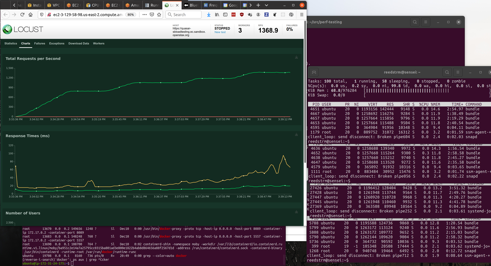
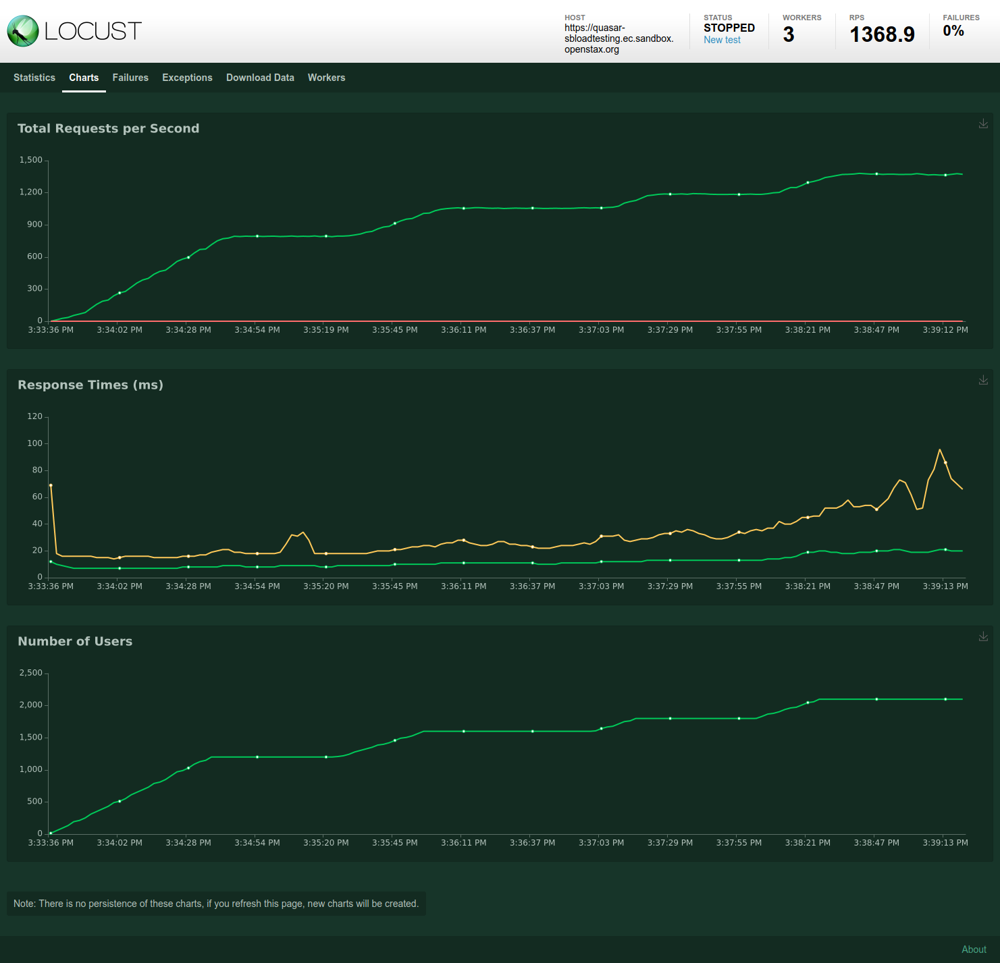

# Performance Testing - response-validator
This repository contains configurations and scripts needed to automate the
performance and scaling behavior for OpenStax `event-capture-api`.  

## Quick Start (Interactive testing)

### Create system under test

Deploy Event Capture API to a sandbox environment.  Be sure the sandbox's 
name has "loadtesting" in the env name (this bypasses normal accounts
user authentication)

Be sure to set up a cloudwatch panel with all the cloudwatch monitors for
all instances in this cluster, API, schema, as well as KSM components. In
particular, be sure to watch network traffic, as well as CPU credits and
usage.

At this time, some parameters are difficult to monitor via cloudwatch, such
as memory usage. You may need to open shell sessions to each instance and 
use local monitoring tools as well, suchas `top`, `iotop`, and `systat`. Don't
overlook the value of  `tail -f logs/production.log`, either.


The [locustfile.py](locustfile.py) in this directory has tasks to create 
events.

An example locust command for a deployment named `dec-11-loadtesting` to run would be:
```
locust -H https://quasar-dec11-loadtesting.ec.sandbox.openstax.org
```
Then access `https://localhost:8089` to run the load tests

## Remote performance cluster testing (still interactive)

To scale up testing and avoid limitations caused by the local dev machine
and local networks, it is desirable to run the locust service on one or more
AWS instances. The manual, step-by-step for th

### Set up a locust master node

Deploy an base Ubuntu instance for the master node (20.04.1 at the time of this writing). If you wish to run workers on this node as well, make sure it is at least t3.micro. Make security policy for this machine, opening port 8089 to all
and port 5557 to the vpc that you are deploying into. Determine the pulic IP address for this host. For example, ec2-3-129-58-98.us-east-2.compute.amazonaws.com

SSH into the locust-master machine, and install docker:

```
sudo apt update
sudo apt install docker
```

Grab this repo, and get to the correct directory (and branch if need be), 
and launch the locust instance:

```
git clone https://github.com/openstax/perf-testing.git
cd perf-testing/event-capture-api

docker run -p 8089:8089 -v $PWD:/mnt/locust locustio/locust -f /mnt/locust/locustfile.py --master -H https://quasar-dec11-loadtesting.ec.sandbox.openstax.org
```

Open the locust-master in a browser:

http://ec2-3-129-58-98.us-east-2.compute.amazonaws.com:8089

You should see the Locust interface, with "0 workers" available.

### Set up one or more worker nodes

Deploy at least one worker node (I'd suggest 3)

Steps are  the same as master. Be sure to set up in the same vpc. The worker nodes do not need any additional ports open to the public. 

To launch workers, use a different docker command:

```
docker run -p 8089:8089 -v $PWD:/mnt/locust locustio/locust -f /mnt/locust/locustfile.py --master-host ec2-3-129-58-98.us-east-2.compute.amazonaws.com
```

Return to your browser, there should now be "workers" available. Start testing!


### Testing and performance monitoring

At this time, we have primarily been testing for sustainable load. The
locustfile simulates a large number of a single event being reported.

Configure all of your monitoring to be visible, or capture, as the case may be.

Start a new test, with appropriate target nunber of users, and watch your
monitoring. I usually screen-cap the graphs tab, (in Firefox, under the `…` i nthe location bar, is a screncap menu, that makes it easy to capture the entire page)

This test just completed running to 1800 loucust-users, successfully supporting
an event rate of more than 1300 events/sec

The four terminals on the right show that the API rails server processes each
used 11-14% of total memory for the instances.



Results screen cap:

